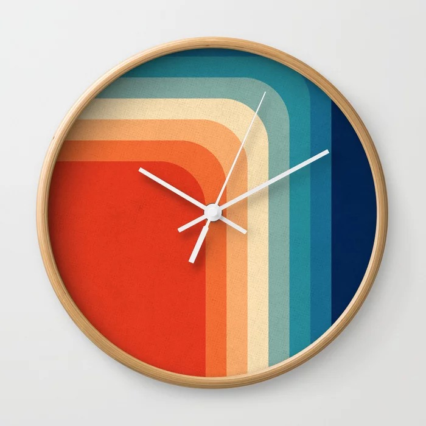

```{r setup, include=FALSE}
knitr::opts_chunk$set(echo = FALSE, warning = FALSE, message =FALSE)
library(tidyverse)
library(janitor)
library(modelr)
library(easystats)
library(broom)
library(AICcmodavg)
library(knitr)
library(gt)
library(glue)
library(DT)
library(kableExtra)
library(plotly)
library(patchwork)
```

## Time Perception
```{r fig.align='center'}

```


I gathered data from people, male and female whose ages ranged from 3-62. I measured their heart rate, age, and the time they felt was 1 minute. The graph below is a quick look at our data showing as age increases, so does the perception of 1 minute. 


```{r dat,echo=FALSE}
dat<-readxl::read_excel("./time_perception.xlsx")
plot1<-dat %>% 
  ggplot(aes(age,seconds_guessed))+
  geom_point()+
  geom_smooth(se=FALSE, method= lm)+
  theme_modern()+
  labs(x="Age", y="Seconds Guessed")

ggplotly(plot1)
```

# Time and Age

I started with a model of only time and age to see if there was any significance in my experiment with out adding other factors in. 
In the model below it is estimated that on average, every year we get older our perception of 1 minute increases by 0.86 seconds, and age shows to be a significant factor. 

```{r}
mod1<-glm(data = dat,
   formula = seconds_guessed ~ age)

tidy(mod1) %>% 
  kable() %>% 
  kable_styling()

```


### Older  participants.
It was thought that the older we get, the faster time goes by for us. Below is a graph of participants that I measured 30 years and older to determine if the majority of these participants perceived a minute to be longer than 60 seconds. If that was true for most measurements then our hypothesis is correct, the older we get, the faster we perceive time. 

### Younger Participants
To agree with our hypothesis that, the older we get the quicker we perceive 1 minute to pass by, the younger participants would percieve 1 minute to pass by before 60 seconds actually passed by. 


In our graph below we see that our hypothesis was correct and are able to compare the younger participants to the older ones. 


```{r}
groupdat<-dat %>% 
  mutate(group1= case_when(age<=29 ~ " Younger than 30", TRUE~"30 and older"))


plot2<-groupdat %>% 
  ggplot(aes(group1,seconds_guessed))+
  geom_boxplot(fill="light blue")+
  theme_classic()+
  ylab("Seconds Guessed")+ xlab("Age")+ggtitle( "Time Perception: Age")

ggplotly(plot2)

```


Not only did we measure time, but other factors too such as heart rate to see if it had any effect on perception of time. 

# Time and Heart Rate 
```{r}

```


### Heart rate vs age as individual factors

```{r}
anova<-glm(seconds_guessed~ age + heart_rate, data = dat)

tidy(anova) %>% 
  kable() %>% 
  kable_styling() %>% 
  row_spec(2, color = "white", background = "black") %>% 
  row_spec(3, color = "white", background = "black")
```

The model above shows the factors of age and heart rate, and the significance of those individual measurements in our study. The numbers are showing us that age is quite significant and heart rate as an individual factor is not very significant to our experiment.

### Correlation between heart rate and age. 

```{r}
anova2<-aov(seconds_guessed~ age * heart_rate, data = dat)

tidy(anova2) %>% 
   kable() %>% 
  kable_styling() %>% 
  row_spec(3, color = "white", background = "black")
```

A significant statistic in our model is 0.05, and as you can see there is a significant correlation between heart rate and age.


# Time and Sex


```{r}
anova3<-glm(seconds_guessed~ age * heart_rate * sex, data = dat)

tidy(anova3) %>% 
datatable()

```

In our table above we can see no significant figures under ~0.05~ in our gender category individually, or that correlate with the other factors measured in this experiment. 


## Conclusion

In conclusion, in my personal experiment I have found that age does have an effect on how we perceive time. However our heart rate and sex have no effect on the matter. 


There are many theorys as to why time perception changes with age, as well as other factors to be considered. An interesting article suggests that time perception is due to how our hormones change over time. 
here is a link to that article.  <https://www.scientificamerican.com/article/why-does-time-seem-to-speed-up-with-age/> 

Another idea is that time perception is associated with memories in the frontal lobe of our brain. In the end, we find there certainly is a correlation with time perception and age, but continue to do research on why that is. 


```{r include=FALSE}
knitr::opts_chunk$set(echo = FALSE, warning = FALSE, message =FALSE)
library(threeBrain)
library(remotes)

threeBrain::brain_setup()

default_template_directory()

n27_path <- file.path(default_template_directory(), "N27")

x <- freesurfer_brain2( fs_subject_folder = n27_path,subject_name = 'N27', surface_types = 'pial')

plot(x)
```

